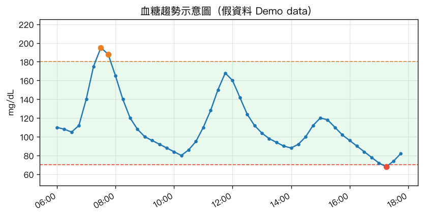

# CareLink 血糖 Telegram 通知 Bot

> 把 Medtronic（美敦力）CareLink 的連續血糖資料，自動推送到家庭 Telegram 群組——
> 高/低血糖即時警報、定時摘要與趨勢圖。為照顧**第一型糖尿病（T1D）**家人而做。
>
> Push your family member's Medtronic CareLink CGM data to a Telegram group —
> real‑time high/low alerts, periodic summaries and trend charts. Built by a
> parent caring for a child with **Type 1 Diabetes (T1D)**.

`#T1D` `#Type1Diabetes` `#第一型糖尿病` `#糖尿病` `#Medtronic` `#美敦力` `#CareLink` `#CGM` `#連續血糖監測` `#Telegram`



> 上圖為**假資料示意圖**。綠色是目標範圍（70–180 mg/dL），橘點＝偏高、紅點＝偏低。
> The chart above uses **demo data only.**

---

## ⚠️ 醫療免責 / Medical Disclaimer

**中文：** 這是用**非官方方式**讀取 CareLink 網頁資料的輔助工具。數據可能延遲、中斷或失準，Medtronic 隨時可能改版讓它失效。**它不能取代** Medtronic 原廠 App、胰島素幫浦／CGM 裝置本身的警報。**請永遠以原廠 App 與裝置為準**，把這個 bot 當「多一層、會主動吵你」的備援提醒。使用風險請自行承擔。

**English:** This is an **unofficial** tool that reads data from the CareLink web app. Data can be delayed, interrupted, or wrong, and Medtronic may change their site and break it at any time. **It is NOT a substitute** for the official Medtronic app or the alarms on the pump/CGM device itself. **Always rely on the official app and device.** Treat this bot only as an extra, noisier backup reminder. Use at your own risk.

---

## 這是什麼 / What it is

一個跑在家裡一台 24 小時開機 Mac 上的小程式，幫你**盯著家人的血糖**，有狀況就主動發 Telegram 訊息給你和另一半。全部用免費工具，不需要月費、不需要 VPN。

A small program that runs on an always‑on Mac at home, **watches your family member's glucose**, and proactively messages you and your partner on Telegram when something happens. Free tools only — no subscription, no VPN required.

### 給誰用 / Who it's for

- 照顧 T1D 孩子或家人、想在他**高血糖或低血糖時第一時間知道**的家長／照護者。
- 家裡有一台可以一直開著的 Mac（Apple Silicon 尤佳）。
- 使用 Medtronic CareLink（歐洲區 `carelink.minimed.eu`，follower／care partner 帳號）。

## 功能 / Features

- 🔴 **低血糖警報**（預設 < 70 mg/dL）／🟠 **高血糖警報**（預設 > 180 mg/dL），跨過門檻立即推播
- 🔁 持續超標每 30 分鐘再提醒、回到範圍報平安
- ⚠️ 資料逾時（感測器離線／上傳中斷）也會通知
- 📊 白天每 3 小時發一次摘要（目前值、範圍內比例 TIR、平均／最高／最低）+ 趨勢圖
- 💬 指令 `/now` `/chart` `/status`
- 📒 可選擇把每筆血糖寫進 Google Sheets

### Telegram 警報長相（示意）/ Example alerts

```
🔴 低血糖警報
68 mg/dL ↘️  ⚠️ 偏低
🕒 06/19 03:14

🟠 高血糖警報
196 mg/dL ⬆️  ⚠️ 偏高
🕒 06/19 08:05

📊 血糖摘要
112 mg/dL ➡️
近 12 小時（98 筆）
• 範圍內：82%
• 平均：128 mg/dL
• 最低 / 最高：63 / 201
```

## 運作原理 / How it works

三個各自獨立、開機自動啟動的服務（launchd）：

```
[瀏覽器保活服務]  開一個 Chrome 一直開著，保住 CareLink 登入、
 carelink_web.py   過期前自動刷新 token，每 240 秒用純 HTTP 抓血糖
        │ 寫
        ▼
   raw_dump.json
        │ 讀
        ▼
[Telegram bot]    每 5 分鐘讀檔，判斷高/低/逾時 → 發警報；
   bot.py         每 3 小時發摘要 + 趨勢圖；回應指令
        ▼
   Telegram 群組（你 + 另一半）   +   Google Sheets（選填）

[看門狗 watchdog]  每 10 分鐘檢查 raw_dump.json；卡超過 30 分鐘
   watchdog.sh     就自動重啟保活服務（CareLink 偶爾強制登出且
                   重新授權卡死時自癒，不用手動處理）
```

**幾個關鍵設計（也是踩過坑換來的）：**

- **不需要 VPN。** 網頁版登入走 `carelink-login.minimed.eu`（Auth0），多數地區可直連。
- **登入狀態存成 storage_state（session cookie）**，不靠瀏覽器 profile（session cookie 關掉就消失）。
- **抓資料走純 HTTP**：用 cookie 裡的權杖當 `Authorization: Bearer`，不靠脆弱的瀏覽器畫面操作。
- **token 自動刷新**：常駐的瀏覽器會在過期前自動換新權杖，**不用每天重新登入**。
- **卡死自動自癒**：CareLink 不定期強制登出、重新授權偶爾卡死，看門狗會自動重啟保活服務（2–4 分鐘內恢復）。
- 只有 CareLink 長期 session 失效（重啟也救不回）時，才需要重跑一次登入。

> Three independent launchd services: a browser stays logged in and refreshes the
> token automatically while a pure‑HTTP call fetches glucose into a file; the
> Telegram bot reads that file and sends alerts/summaries; a watchdog restarts
> the keepalive service if data stalls (CareLink occasionally force-logs-out and
> the re-auth can hang). No VPN needed.

## 安裝 / Get started

完整步驟看 **[SETUP.md](SETUP.md)**（約 30 分鐘）。常見問題看 **[FAQ.md](FAQ.md)**。

```bash
git clone https://github.com/oeoeoeooeo/carelink-glucose-telegram-bot.git
cd carelink-glucose-telegram-bot
# 接著照 SETUP.md 做
```

## 支援的裝置 / Devices

理論上凡是會把資料上傳到 CareLink、且能在 `carelink.minimed.eu` 網頁看到即時血糖的
Medtronic 系統都適用（例如 MiniMed 7xxG 系列 + Guardian 感測器、follower 帳號）。
實測環境為歐洲區 CareLink。其他區域歡迎回報。

## 聯絡 / Contact

問題、建議、想分享你的使用經驗，歡迎來信：**oeoeoeooeo@gmail.com**
（也歡迎開 [Issue](https://github.com/oeoeoeooeo/carelink-glucose-telegram-bot/issues)）

如果這個專案幫到你的家庭，給顆 ⭐ 讓更多 T1D 家庭找得到它。
If this helped your family, a ⭐ helps other T1D families find it.

## 授權 / License

[MIT](LICENSE) © 2026 oeoeoeooeo

本專案與 Medtronic 無任何關係，CareLink 為 Medtronic 之商標。
Not affiliated with Medtronic. CareLink is a trademark of Medtronic.
